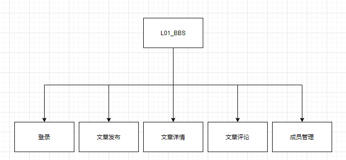

# 1. 引言

## 1.1 编写目的
可行性研究报告的目的是通过对本系统的可行性的探讨，论证实现本项目的可能性和一些前期的准备工作及工作条件，为工程的下一步设计做铺垫。本报告是对该系统的可行性研究的综合报告。

## 1.2 项目背景
随着计算机技术的发展，越来越多的以往依靠人类手工完成的工作可以让计算机来替代，从而大大的提高工作的效率。过去书店的管理模式大多以手工为主，图书采购后的入库，图书的销售，图书的查询大多停留在纸质手工的层面上。这种模式存在着效率低下，人工成本巨大，数据容易遗失等缺点。现代社会中，一些比较大型的连锁书店及规模大，实力雄厚的书店已经开始使用自己的专用的书店信息管理系统，而很多小型的书店由于开发成本原因至今还没有使用。
随着市场上书籍的种类和数量的增多，更新的速度越来越快，小型书店对图书信息的处理量增加迅速，所需要处理的数据也随之增多。传统手工销售和人工管理模式弊端出现:图书采购、库存、销售和核算的手工信息管理存在工作量大，服务质量差，工作效低，耗费人员多，图书的市场、库存、销售、读者反馈信息不能及时获取等问题。开发适合中小型书店的信息管理系统势在必行。
随着计算机技术的发展，越来越多的人想要在网络上发表自己的意见，于其他志同道合的人共同探讨问题，解决问题。
所以就需要的打造一个内容丰富，由游客做主的地方，可以发表自己的观点，发表优质的内容。
并且，论坛的互动性好，增加了网站的粘度，pv量也随之增加，对seo的排名的提升是由明显效果的。还可以有效的解决更新问题，不用担心是否有内容更新，有人发文章，有人跟帖回复，站长根本用不着为内容去操心。

## 1.3 参考资料
http://www.duanwenjie.com/4609.html
http://www.php.com
http://mysql.com
# 2. 可行性研究的前提

## 2.1 要求

### 2.1.1 功能

1. 为开发者提供一个良好的交流平台，为创意工作者提供一个交流的方式。
2. 实现文章内容的存储，转发，评论，统计等一系列功能。

### 2.1.2 性能

文章内容和评论信息必须准确的反映在论坛的页面上，用户的操作必须及时地存储到论坛所使用的服务器上，对服务器的数据必须进行及时正确的增删改查，由于系统目前计划长时间使用，对系统可靠性具有一定的要求，尽量减少故障的发生，以及对数据的容灾备份。当外部环境发生变化时，系统也需要一定的快速适应能力。

### 2.1.3 系统输入要求

1. 数据完整,翔实。
2. 内容符合和国家规定。

### 2.1.4 系统输出要求

1. 简洁
2. 准确
3. 高效

### 2.1.5 安全与保密要求

通过权限的设置对不同的用户提供不同的数据，以保证数据的安全性和保密要求。对断电，死机，系统奔溃等问题有有力措施以保障数据不受损失。

### 2.1.6 与软件相关的其他要求

本系统采用 c/s 结构 ，以 phpStorm 2020.2.1 为开发平台，采用 php 7.4.10 语言，采用 docker mysql:latest 作为数据库管理系统。

## 2.2 目标

系统实现后，给开发者和创意工作者提供一个交流的平台，降低人们交流的成本，减少信息交流的成本，舍去现实物理环境中交流的繁琐过程，以及地域环境等所带来的开销，并可利用用户进行数据统计，因为用户目标定位为具体人群所以数据有效性更高。

## 2.3 条件，假定和限制

- 建议软件寿命：10年。
- 经费来源：捐赠，（用爱发电）。
- 硬件条件：aliyum ECS 突发性能 t5，终端为pc。
- 运行环境：centos7 ， docker Ubuntu image。
- 投入运行最迟时间：2020年1月1日。

## 2.4 可行性研究方法

这项可行性研究是基于两个方面的，一个是基于对现有的论坛系统，如豆瓣，v2 等 取其优点的开发意图。二是基于现有系统，如szhq.zknu.edu.cn/dsh/pchome/marketindex 周口师范后勤服务大厅二手市场板块，或者类似项目，从中吸取相应的经验教训，此外，这项研究还立足于满足开发者和创意工作者的需求，做了大量的调查。

## 2.5 评价策略

- 利用有限的项目开发经费，力求开发性价比最高的软件。
- 用户满意度，努力提高用户满意度。
- 项目开发周期，力求在最短的时间内完成项目。

# 3. 对现有系统的分析

## 3.1 处理流程和数据流程

- http://szhq.zknu.edu.cn/dsh/pchome/marketindex 周口师范后勤服务大厅二手市场板块。

二手市场板块作为周师的一块重要业务还停留在相对基础的功能上，只提供小部分功能，并且没有提供学生认证，seo 相对也不友好。

## 3.2 工作负荷

现有的系统所承担的工作只能实现简单的出售，购买两者的信息发布功能，已无法适应目前的用户对于交流，交易的需求。

# 4. 所建议系统技术可行分析

## 4.1 对系统的简要概述

为了提升交易，交流的的效率和管理水平，以及用户体验，本组计划投入一定资金以及用爱发电建立论坛系统，以全面管理交易，实现用户交流的需求。本组人员以及部分参与者对于所建立的论坛系统有以下基本需求：

1. 建立对发布内容提供全面管理的论坛管理系统。
2. 对所有用户发布内容提供全面管理与关键字审查。
3. 对一般用户，工作人员的管理权限进行严格区分。
4. 对数据，用户信息进行全面管理，以提供安全。

## 4.2 处理流程和数据流程

### 4.2.1功能模块

根据用户对系统的初步要求，为满足用户日常业务管理需求，实现内容与管理，内容展示与管理，用户登录与注册，用户管理，内容发布等一系列功能。系统拟划分的功能模块如图所示：

### 4.2.2 系统流程图

系统涉及的核心业务有：内容发布，内容展示，用户注册，下面将对这些业务的业务流程进行分析。

内容发布业务系统流程：根据用户提供的markdown内容，渲染html存入数据库。

内容展示业务系统流程：根据数据库所有的集合，取出需要展示的内容进行渲染。

## 4.3 采用建议系统可能带来的影响

本系统的开发能够提高工作效率，扩大服务范围，增加用户人数，使用户能够及时获取信息，减少决策失误，提高决策正确率，减少用户的时间损耗，提高信息传播效率。该系统还能够及时传达各方行业信息，提高行业内交流，促进个人能力发展，促进业务能力等综合能力。

## 4.4 技术可行性评价

1. 信息系统开发方法：在开发小组中有专门的php技术人员，有大学三年的技术学习经历，拥有熟练掌握面向对象方法开发软件系统的资深的系统分析员和php程序员，以及拥有3年运维经验的老运维工程师，以及数位自身产品经理。所以在信息系统开发方法上不存在任何问题。
2. 网络和通信技术：在本开发小组中有专门的网络技术人员数名，有三年的大型网络组网经验。
3. B/S 结构规划和设计技术：开发小组拥有丰富的 B/S 开发经验，拥有多个 B/S 架构系统的开发经验，以及长时间的团队协作经验。
4. 数据库技术：开发小组拥有丰富的关系/非关系型数据库的使用以及优化经验，拥有高级数据库管理员数名。
5. php 开发技术：开发小组拥有扎实的php开发基础，大型项目的开发经验，php高级程序员数名。

# 5. 成本效益分析

## 5.1成本估算

### 5.1.1 系统开发费用

1. 人员费用：本系统开发周期5周，试运行周初5周。开发期间所需开发人员10人，试运行期间需开发人员1人。因为用爱发电，所以不计算人员费用。
2. 硬件设备费用：系统所需的硬件费用约 368970 RMB。
   - 服务器一台			97元*10
   - 微机10台 			  60000元
   - 网络设备和布线    500元*10
   - 工作台                   3000元
   - 工作室租用            30000元*10
3. 软件费用：系统所需购买的软件费用约 45430 RMB。
   - Windows10 					                    0RMB
   - Centos								                 0RMB
   - Ubuntu								                0RMB
   - Docker						                         0RMB
   - Mysql						                           0RMB
   - Php 						                             0RMB
   - Nginx						                           0RMB
   - JetBrains All Products Pack              $6490
4. 耗材费用：0.5 万人民币。
5. 咨询和评审费用：1.5 万人民币。

### 5.1.2 系统运行费用

假定本系统的运行维护时间为10年，每年的运行维护费用如下所示：

1. 系统维护费用：一年需要 5000 RMB 人/年 维护费用，维护费用为 5000 * 10 = 5万人民币。
2. 设备维护费用：设备的运行更新期 10 年，设备更新费用为 0 元，设备日常故障维护费用每年 1 万元人民币。则平均每年设备维护费用为 1 万元人民币。
3. 消耗材料费用：每年消耗材料费用按 1 万 人民币计算。

系统每年运行费用 7 万人民币, 10 年累计系统运行费用 70 万人民币。

系统开发和运行总费用: 368970 RMB + 45430 RMB + 0.5 万RMB + 1.5 万RMB + 70 万RMB = 113 万RMB , 折合 11 万人民币每年.

## 5.2 收益分析

1. 提高工作效率
2. 提高交流效率
3. 提高交易效率
4. 及时获取信息
5. 减少决策失误
6. 具有良好的社会效益

# 6. 社会可行性分析
目前已有很多成功开发论坛系统的先例，社会需要人们之间的相互交流。并且论坛系统的开发运行与国家的政策法规不存在任何冲突和抵触之处。另外，论坛系统所采用的操作和运行方式符合游客的日常习惯，操作方便灵活，便于学习。综上，开发论坛系统具有可行性。

## 6.1 操作可行性分析
该系统提供窗体界面，操作简单。
1.客户要求有基本的计算机使用能力。
2.系统管理员要有一定的计算机基础知识，能够熟练的管理本系统，使其正常运行。
## 6.2 法律因素
1.所有技术资料都由提出方保管。
2.遵守网络法律的一切要求。
3.合同制定确定违约责任。
# 7. 结论意见
通过对项目整体进行可行性分析，该项目无论在操作可行性、技术可行性、经济可行性及社会可行性上均满足要求，因此，开发此系统的构想是可行的，可着手进行。

